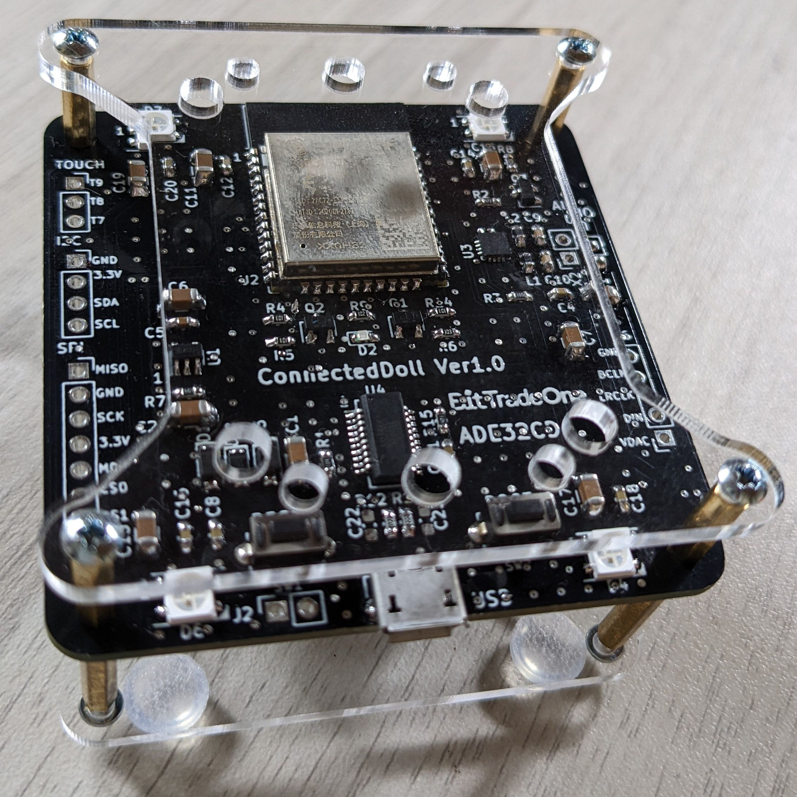
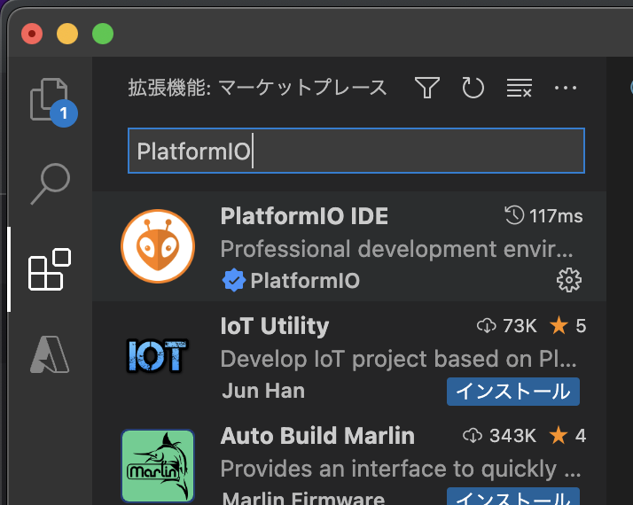

# ConnectedDoll サンプルリポジトリ

## 概要
インターネット上にある音声データを再生する装置を作れるキットです。  
ESP32 for Arduino互換ボード なので 独自ファームの開発も可能です。



# 必要な知識など
- ESP32 for Arduino 
- Wi-Fi の 基本的な設定
- PlatformIO IDE の 簡単な使い方
  
# 環境構築
開発環境は PlatformIO IDE を利用します。
[PlatformIO Doc](https://docs.platformio.org/en/latest/)

## 構築手順
1. VSCode のインストール
   1.  [https://code.visualstudio.com/](https://code.visualstudio.com/)
   2.  Download から 環境にあわせたものをインストールする
   
2. PlatformIO for VSCode インストール
    1. VSCode を起動して 拡張機能 を選択
    2. `PlatformIO` を検索
    3. インストールする



この作業で環境構築の完了です。

# 基板回路図
[ADE32CM_V1.1_Schematics.pdf](https://github.com/bit-trade-one/ADE32CD-Connected-Doll/blob/master/Schematics/ADE32CM_V1.1_Schematics.pdf)

- ESP32-WROOM-32
- MAX98357AETE-T
- FT231XS

# IO定義 ヘッダーファイル
`connected-doll.h` 各IOの利用がしやすいように名前を定義したヘッダーファイル

```
#ifndef __CONNECTED_DOLL_
#define __CONNECTED_DOLL_

#define IO0 0
#define LED1 13

// I2S MAX98357A
#define I2S_BCLK 26
#define I2S_LRC  25
#define I2S_DOUT 21

// IO4 NeoPixels
#define RGB_LED_PIN 4

// タッチセンサー
#define TOUCH7 T7
#define TOUCH8 T8
#define TOUCH9 T9

#endif // __CONNECTED_DOLL_

```

# PlatformIO 設定ファイル
`platformio.ini` に 書き込みボーレート等の設定をする事ができます。

```
[env:esp32dev]
platform = espressif32
board = esp32dev
framework = arduino
lib_ldf_mode = deep+

upload_speed = 921600
monitor_speed = 921600
```

# 各サンプルの ビルド & 実行方法
1. VSCode を開く
2. PlatformIO を選択して Open で開く  

3. Open Project で `examples` 以下のサンプルを指定する
4. 表示 -> コマンドパレット で `PlatformIO Upload` を検索して実行する
   - キーボードショートカット control + option + u でも実行できる
5. 実機で ビルド結果が動作する

# コンソールの確認
1. VSCode を開く
2. PlatformIO を選択して Open で開く  

3. Open Project で `examples` 以下のサンプルを指定する
4. 表示 -> コマンドパレット で `Serial Monitor` を検索して実行する
   - キーボードショートカット control + option + s でも実行できる
5. Serial.print 内容が表示される

# サンプルコード

| 名前 | 内容 | 備考 | 
|:--:|:--:|:--:|
|Blink|LED 点滅|./examples/Blink|
|RGB Blink|RGB LED 点滅|./examples/RgbBlink|
|WiFi Client| WiFi クライアント接続|./examples/WiFiClient|
|HTTPサーバー| HTTPサーバー / ブラウザから LED点灯,消灯|./examples/HttpServer|
|WiFi AP| WiFi APモード|./examples/WiFiAp|
|Touch| タッチセンサー |./examples/Touch|
|HTTP MP3 Player| MP3 ストリーミング再生 |./examples/HttpMp3Player|
