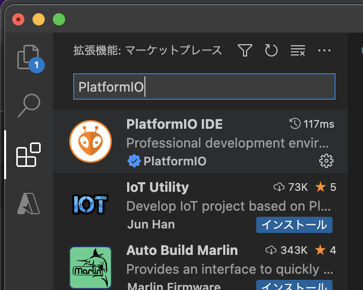

# HTTP_SERVER
HTTPサーバーサンプル

# 環境構築
開発環境は PlatformIO IDE を利用します。
[PlatformIO Doc](https://docs.platformio.org/en/latest/)

## 構築手順
1. VSCode のインストール
   1.  [https://code.visualstudio.com/](https://code.visualstudio.com/)
   2.  Download から 環境にあわせたものをインストールする
   
2. PlatformIO for VSCode インストール
    1. VSCode を起動して 拡張機能 を選択
    2. `PlatformIO` を検索
    3. インストールする

# 各サンプルの ビルド & 実行方法
1. VSCode を開く
2. PlatformIO を選択して Open で開く  

3. Open Project で `examples` 以下のサンプルを指定する
4. 表示 -> コマンドパレット で `PlatformIO Upload` を検索して実行する
   - キーボードショートカット control + option + u でも実行できる
5. 実機で ビルド結果が動作する

# コンソールの確認
1. VSCode を開く
2. PlatformIO を選択して Open で開く  

3. Open Project で `examples` 以下のサンプルを指定する
4. 表示 -> コマンドパレット で `Serial Monitor` を検索して実行する
   - キーボードショートカット control + option + s でも実行できる
5. Serial.print 内容が表示される